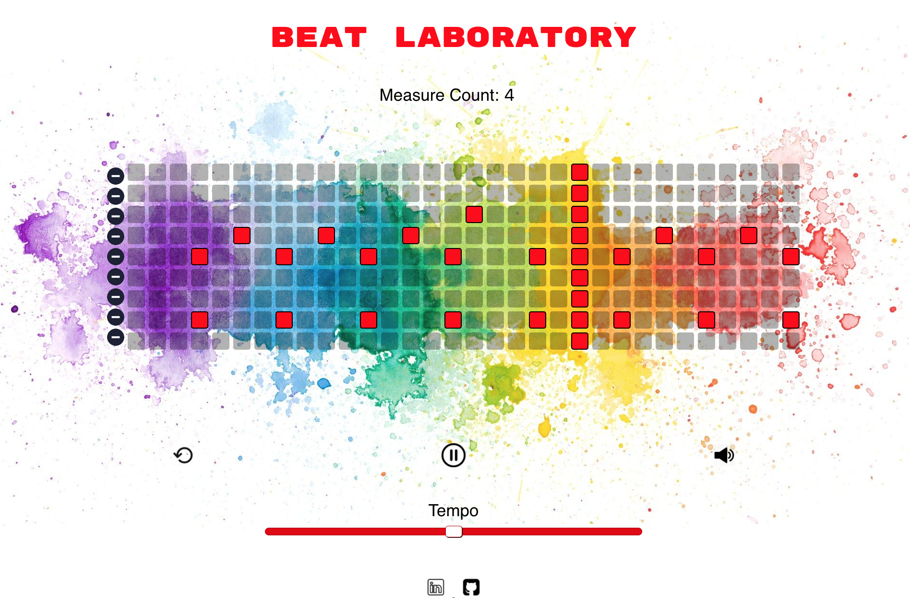

# Beat-laboratory

A fun, sandbox-type application for users to experiment creating beats on a virtual drumset. No packages or libraries are used anywhere in the project, just vanilla JS, HTML and CSS! 

Here's a link to the [link to live site](https://romance939913.github.io/Beat-laboratory/ "live site")

Leveraged Object-oriented Javascript to create the main features: The Tempo bar and the Beat table.
